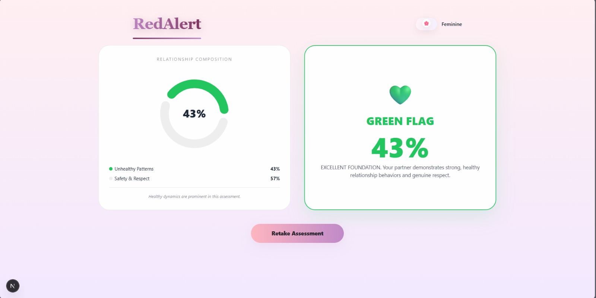
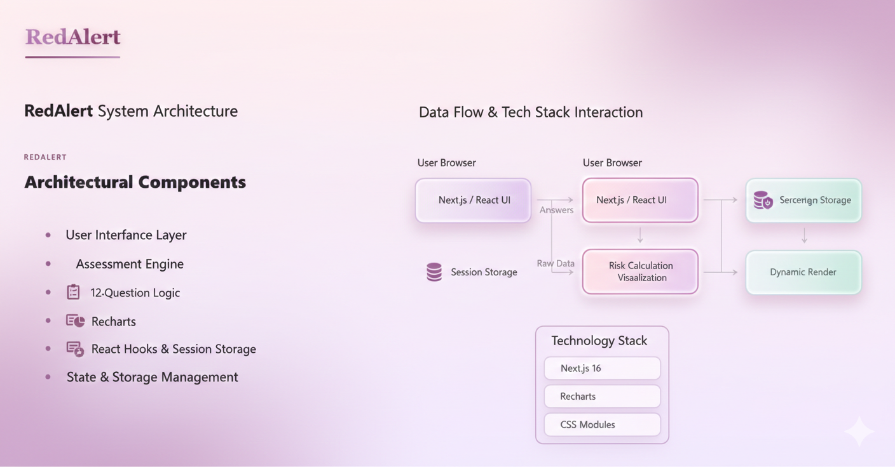

<p align="center">
  
</p>

# [RedAlert] 🎯

## Basic Details

### Team Name: [DevVerse]

### Team Members
- Member 1: [Niveditha S George] - [VJCET]
- Member 2: [Harsha S] - [VJCET]

### Hosted Project Link
[mention your project hosted link here]

### Project Description
[RedAlert is a relationship awareness tool that evaluates your partner’s behavior through a simple questionnaire. It generates a color-coded risk assessment (Green, Red, Black) with clear descriptions to help users understand potential warning signs and relationship health.
]

### The Problem statement
[Many individuals enter relationships without fully understanding potential risks in their partner’s behavior, which can lead to emotional or psychological harm. There is a need for a simple, reliable tool to assess and highlight concerning behaviors early.
]

### The Solution
[Here’s a concise solution for your project:

**Solution:** RedAlert provides a quick and interactive questionnaire to evaluate a partner’s behavior. It calculates a score and generates a color-coded flag  with descriptions, helping users identify risks and make informed decisions about their relationship.
]

---

## Technical Details

### Technologies/Components Used

**For Software:**
- Languages used: [JavaScript, TypeScript]
- Frameworks used: [React, Next.js]
- Libraries used: [React Hooks, CSS Modules]
- Tools used: [VS Code, Git, Chrome DevTools]

**For Hardware:**
No HardWare (Fully Software Based)
---

## Features
* **Feature 1: Flag-Based Risk Assessment** – Assigns a color-coded flag (Green, Red, Black) based on partner behavior to highlight relationship health.
* **Feature 2:Risk Percentage** – Calculates a risk percentage from user responses for precise assessment.
* **Feature 3: Detailed Descriptions** – Provides short, clear descriptions for each flag to explain potential risks or positives.
* **Feature 4: Dark/Light Mode & Retake Option** – Users can toggle between dark and light themes or masquiline and feminine themes and retake the assessment anytime.


## Implementation

### For Software:

#### Installation
```bash
[git clone https://github.com/harshasujays/tinkerhackmain.git,
cd redalert , npm install]
```

#### Run
```bash
[Run commands - e.g., npm start,npm run dev,npm install recharts]
```

### For Hardware:

#### Components Required
[No Hardware]

#### Circuit Setup
[Nill]

---

## Project Documentation

### For Software:

#### Screenshots (Add at least 3)


*The RedAlert Assessment Page is a focused, single-question interface designed to evaluate specific relationship dynamics in a clean, distraction-free environment.*


*User Answering The Quiz*


*Results Generated based on the quiz*

#### Diagrams

**System Architecture:**


*The RedAlert system is a client-side web application designed for privacy-focused relationship assessments using a modern frontend stack of Next.js 16 and React. The architecture follows a secure data flow where user responses to a 12-question evaluation are captured through a "Feminine/Masculine" themed interface and stored exclusively in the browser's Session Storage. By avoiding backend server interaction, the system ensures complete user anonymity. Upon completion, a dedicated assessment engine maps these raw answers to a numerical scale to calculate a Severity Index**, which is then dynamically rendered into interactive donut and bar charts using the Recharts library to provide immediate, visual feedback on relationship health.

**Application Workflow:**


*Empowering your safety through data, RedAlert transforms personal reflections into a private, visual dashboard of your relationship health. Using a secure, client-side workflow, it analyzes patterns of respect and control to provide immediate clarity and essential emergency resources when you need them most.*

---

## Project Demo

### Video
[https://drive.google.com/file/d/1n3OzBkVZ1Y2gOUk4aGgeqnp3Vya6uYiQ/view?usp=drive_link]


## AI Tools Used (Optional - For Transparency Bonus)

If you used AI tools during development, document them here for transparency:

**Tool Used:** [GitHub, Copilot,Google Gemini, ChatGPT]

**Purpose:**
- GitHub:  "Collaboration"
- Chatgpt: "UI/UX Designing"
- Copilot: "Debugging Complex Functions"
- Google Gemini: "Code review and optimization suggestions"

**Key Prompts Used:**
- "Generate a 3-column transparency-focused dashboard"
- "Debug this async function that's causing race conditions"

**Percentage of AI-generated code:** [30%]

**Human Contributions:**
- Architecture design and planning
- Empathetic Thinking
- Integration and testing
- UI/UX design decisions
---
## Team Contributions

- [Niveditha S George]: [Frontend development, UI/UX development.]
- [Harsha S]: [Frontend Development, Documentation]


---

## License

This project is licensed under the [LICENSE_NAME] License - see the [LICENSE](LICENSE) file for details.

**Common License Options:**
- MIT License (Permissive, widely used)
- Apache 2.0 (Permissive with patent grant)
- GPL v3 (Copyleft, requires derivative works to be open source)

---

Made with ❤️ at TinkerHub